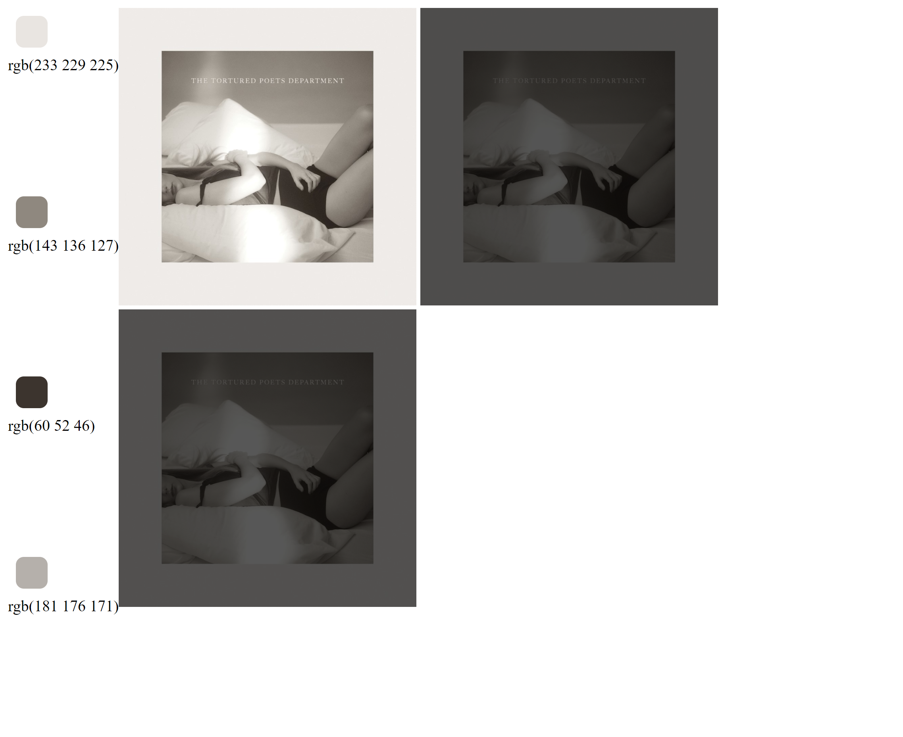

# Color manipulation

## Usage
```bash
live-server .
```

Open /analyser.
Input image.
You will get darkened image + clusters of the most common colors.
Example result:


(used for color generation at [kaif release-page](http://github.com/kaifhq/release-page)
